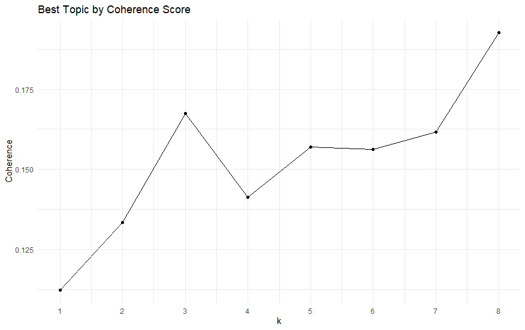

```{r setup, include=FALSE}
knitr::opts_chunk$set(warning=FALSE)
```

```{r include=FALSE}
#Import dataset in MAY2020 & data cleaning
library(readr)
library(ggplot2)
library(dplyr)
library(measurements)
library(tidyr)
library(maps)
library(stringr)
library(prettyR)
library(dbplyr)
library(tidytext)
library(plotly)
library(IRdisplay) 
library(textmineR)
library(qdap)
library(tm)
library(RWeka)
library(RColorBrewer)
library(ggthemes)

NY<-read_csv("Data_Job_NY.csv")
SF<-read_csv("Data_Job_SF.csv")
TX<-read_csv("Data_Job_TX.csv")
WA<-read_csv("Data_Job_WA.csv")

GD<-read_csv("glassdoor.csv")

TX<-TX[1:146,]

MAY2020<-rbind(SF,TX,WA)
MAY2020<-MAY2020%>%mutate(line=1:1927)
df_salary=MAY2020[which(MAY2020$Min_Salary > 0 & MAY2020$Max_Salary > 0),]
```

Explories on text
1.Frequent words
```{r}
Titles<-MAY2020[,1]
Titles<-sapply(Titles,as.character)
Titles <- tibble(line=1:length(Titles), text=Titles)
tidy_titles <- Titles %>%
  unnest_tokens(word, text)
df1<-tidy_titles%>%anti_join(stop_words)%>%count(word,sort = TRUE)

tidy_titles2 <- Titles %>%
  unnest_tokens(bigram, text, token="ngrams", n=2)
df2<-tidy_titles2%>%count(bigram,sort = TRUE)


Desc<-MAY2020[,7]
Desc<-sapply(Desc,as.character)
Desc<- tibble(line=1:length(Desc), text=Desc)
tidy_desc <- Desc %>%
  unnest_tokens(word, text)
tidy_desc2 <- unnest_tokens(Desc, bigram, text, token="ngrams", n=2)

tidy_desc%>%
  anti_join(stop_words)%>%
  count(word, sort=TRUE)%>%
  filter(n>2000)%>%
  ggplot(aes(reorder(word,-n),n,fill=n)) +
  geom_col(show.legend = FALSE)+
labs(x = NULL, y = "frequency of single words") +
  theme(axis.text.y = element_text(face="bold", size=15))+
  coord_flip()

df <- tidy_desc2 %>%
  separate(bigram, c("word1", "word2"), sep = " ")
df <- df %>%
  filter(!word1 %in% stop_words$word) %>%
  filter(!word2 %in% stop_words$word)
df <- df %>%
  unite(bigram, word1, word2, sep = " ") 
df%>%
 count(bigram, sort=TRUE)%>%
  filter(n>400)%>%
  ggplot(aes(reorder(bigram,-n),n,fill=n)) +
  geom_col(show.legend = FALSE)+
labs(x = NULL, y = "frequency of bigrams") +
  theme(axis.text.y = element_text(face="bold", size=15))+
  coord_flip()
```
 \paragraph{AHP} Just like what we were told, the plot of frequent words does not make sense. We need to explore more on text by using other skills.

2.LDA
```{r}
#May spend a long time to fit the models
#Do NOT run the following code in 'if{}' with 16GB or less ram
if(FALSE){
data<-MAY2020%>%select(c("line","Job_Desc"))
names(data)<-c("id","text")
data$text <- sub("RT.*:", "", data$text)
data$text <- sub("@.* ", "", data$text)
text_cleaning_tokens <- data %>% 
  tidytext::unnest_tokens(word, text)
text_cleaning_tokens$word <- gsub('[[:digit:]]+', '', text_cleaning_tokens$word)
text_cleaning_tokens$word <- gsub('[[:punct:]]+', '', text_cleaning_tokens$word)
data_stop<-tibble(word=c("data","experience","color","religion","gender","identity","race","veteran","sexual","orientation","equal","opportunity"))
text_cleaning_tokens <- text_cleaning_tokens %>% filter(!(nchar(word) == 1))%>% 
  anti_join(stop_words)%>%
  anti_join(data_stop)
tokens <- text_cleaning_tokens %>% filter(!(word==""))
tokens <- tokens %>% mutate(ind = row_number())
tokens <- tokens %>% group_by(id) %>% mutate(ind = row_number()) %>%
  tidyr::spread(key = ind, value = word)
tokens [is.na(tokens)] <- ""
tokens <- tidyr::unite(tokens, text,-id,sep =" " )
tokens$text <- trimws(tokens$text)

dtm <- CreateDtm(tokens$text, 
                 doc_names = tokens$id, 
                 ngram_window = c(1, 2))
tf <- TermDocFreq(dtm = dtm)
original_tf <- tf %>% select(term, term_freq,doc_freq)
rownames(original_tf) <- 1:nrow(original_tf)
vocabulary <- tf$term[ tf$term_freq > 1 & tf$doc_freq < nrow(dtm) / 2 ]
dtm = dtm
k_list <- seq(1, 8, by = 1)
model_dir <- paste0("models_", digest::digest(vocabulary, algo = "sha1"))
if (!dir.exists(model_dir)) dir.create(model_dir)
model_list <- TmParallelApply(X = k_list, FUN = function(k){
  filename = file.path(model_dir, paste0(k, "_topics.rda"))
  
  if (!file.exists(filename)) {
    m <- FitLdaModel(dtm = dtm, k = k, iterations = 500)
    m$k <- k
    m$coherence <- CalcProbCoherence(phi = m$phi, dtm = dtm, M = 5)
    save(m, file = filename)
  } else {
    load(filename)
  }
  
  m
}, export=c("dtm", "model_dir")) 
coherence_mat <- data.frame(k = sapply(model_list, function(x) nrow(x$phi)), 
                            coherence = sapply(model_list, function(x) mean(x$coherence)), 
                            stringsAsFactors = FALSE)
ggplot(coherence_mat, aes(x = k, y = coherence)) +
  geom_point() +
  geom_line(group = 1)+
  ggtitle("Best Topic by Coherence Score") + theme_minimal() +
  scale_x_continuous(breaks = seq(1,8,1)) + ylab("Coherence")
model <- model_list[8][[ 1 ]]
model$top_terms <- GetTopTerms(phi = model$phi, M = 20)
top20_wide <- as.data.frame(model$top_terms)
}
#show thw results in png
```



The second plot shows the result of LDA. The grouping result of LDA is interesting that some of the groups are classified according to industry(like bioinformatics), others are classified according to the type of job(like machine learning engineer). But still we could find that, no matter what k we choose, there is a group with words clinical, medical and genentech in it. 


3.Words&Bigrams grouping
```{r}
data<-MAY2020%>%select(c("line","Job_Desc"))
data<-VectorSource(data$Job_Desc)
data<-VCorpus(data)
clean_corpus <- function(corpus){
  corpus <- tm_map(corpus, stripWhitespace)
  corpus <- tm_map(corpus, removePunctuation)
  corpus <- tm_map(corpus, content_transformer(tolower))
  corpus <- tm_map(corpus, removeWords, c(stopwords("en"), "data","experience"))
  return(corpus)
}
data<-clean_corpus(data)
tdm<-TermDocumentMatrix(data)
tdm2 <- removeSparseTerms(tdm, sparse = 0.6)
hc <- hclust(d = dist(tdm2, method = "euclidean"),  method = "complete")
plot(hc)

tokenizer <- function(x)
  NGramTokenizer(x, Weka_control(min = 2, max = 2))
tdm_bi<-TermDocumentMatrix(data,control = list(tokenize = tokenizer))
tdm_bi2 <- removeSparseTerms(tdm_bi, sparse = 0.9)
hc2 <- hclust(d = dist(tdm_bi2, method = "euclidean"),  method = "complete")
plot(hc2)
```
\paragraph{AHP} In order to explore more, we decided to group the words and bigrams in text. The grouping result of single words does not make sense as expected, but the result of bigrams does bring us something useful and inspire us with the following investigations.

4.Words about data science softwares
```{r}
LanguageList<-tibble(word=c('python', 'java', 'php', 'javascript', 'r', 'ruby', 'perl','c', 'sql','kotlin','tableau'))
textwords3<-LanguageList%>%left_join(tidy_desc,by="word")
Languagefreq<-as_tibble(table(textwords3))%>%spread(key=word,value=n)
Languagefreq<-Languagefreq%>%
  mutate_at(.vars = vars(line), .fun = as.numeric) 
#Languagefreq_T <- as.data.frame(t(as.matrix(Languagefreq)))
language_count <-sapply(Languagefreq, function(y) sum(length(which(y>0))))
language_count <- data.frame(language_count)
language_count <- tibble::rownames_to_column(language_count, "language")
language_count <-language_count[-1,]
  ggplot(data=language_count,aes(x=reorder(language,-language_count),y=language_count))+
    labs(x="data science softwares")+
    geom_col(fill='orange')
  color <- RColorBrewer::brewer.pal(4, 'Accent') 
fig<-language_count%>%
#  mutate(type=c('python', 'java', 'c++', 'php', 'javascript', 'r', 'ruby', 'perl','c','c#', 'sql','kotlin'))%>% 
plot_ly(labels = ~language,values=~language_count,
        marker = list(colors = color),
        textposition = 'inside',
        textinfo = 'label+percent',
        type = 'pie')
fig
```

Other EDAs
```{r}
#salary vs states
salary_state_fig1<-df_salary %>%
  group_by(State) %>%
  summarize(c=n(),
            mean_min = as.integer(mean(Min_Salary, na.rm = TRUE)),
            mean_max = as.integer(mean(Max_Salary, na.rm = TRUE)))%>% 
  filter(c > 4)%>%
ggplot(aes( y = Salary)) + 
  geom_segment(aes(x=State, xend=State, y=mean_min, yend=mean_max), size=8, color="orange") +
  geom_label(aes(x=State, y=mean_min,  label = mean_min))+
  geom_label(aes(x=State, y=mean_max,  label = mean_max))+
  scale_y_continuous(labels = scales::dollar_format(scale = .001, suffix = "K"))+
  ggtitle("Salary Range in Different States in Sept. 2019") +
  theme(text = element_text(size=15))

#industry
industry_fig1<-MAY2020 %>%
  group_by(Industry) %>%
  summarize(count=n())%>% 
  filter(count > 10 & !is.na(Industry))%>%
  ggplot(aes(x= reorder(Industry,count),count,fill=count))+geom_bar(stat ="identity") +
  geom_col(show.legend = FALSE)+
  theme_wsj()+
  coord_flip()

#company
company_fig1<-MAY2020 %>%
  group_by(Company) %>%
  summarize(count=n())%>% 
  filter(count > 15 & !is.na(Company))%>%
  ggplot(aes(x= reorder(Company,count),count,fill=count))+geom_bar(stat ="identity") +
  geom_col(show.legend = FALSE)+
  theme_wsj()+
  coord_flip()

salary_state_fig1
industry_fig1
company_fig1
```

```{r}
salary_industry_fig1<-df_salary %>%
  group_by(Industry) %>%
  summarize(c=n(),
            mean_min = as.integer(mean(Min_Salary, na.rm = TRUE)),
            mean_max = as.integer(mean(Max_Salary, na.rm = TRUE)))%>% 
  filter(c > 10 & !is.na(Industry))%>%
  ggplot(aes(y = Salary)) + 
  geom_segment(aes(x=Industry, xend=Industry, y=mean_min, yend=mean_max), size=5, color="orange") +
  geom_label(aes(x=Industry, y=mean_min,  label = mean_min),label.padding = unit(0.1, "lines"),label.size = 0.15)+
  geom_label(aes(x=Industry, y=mean_max,  label = mean_max),label.padding = unit(0.1, "lines"),label.size = 0.15)+
  scale_y_continuous(labels = scales::dollar_format(scale = .001, suffix = "K"))+
  ggtitle("Salary Range in Different Industry in May 2020") +
  #scale_x_discrete(limits=c("1","2","3","4","5"))+
  theme_economist()+
  coord_flip()
salary_industry_fig1
```


Adding new features to the dataset
1.Types of data science jobs
```{r}
KEY_TITLE<-tibble(bigram=c("data engineer","data analyst","machine learning"))
titlewords<-KEY_TITLE%>%left_join(tidy_titles2,by="bigram")
titlefreq<-as_tibble(table(titlewords))%>%spread(key=bigram,value=n)
names(titlefreq)[2:4]<-c("data_analyst_title","data_engineer_title","machine_learning_title")
titlefreq<-titlefreq%>%
  mutate_at(.vars = vars(line), .fun = as.numeric) 

KEY_TEXT1<-tibble(word=c("engineering","engineer", "engineers",
                         "analysis", "analyses", "analytics", "analyst",
                         "modeling",       
                         "statistics",        
                         "database", "databases",   
                         "visualization",       
                         "mining",
                         "optimization",
                         "wrangling"
))
KEY_TEXT2<-tibble(bigram=c("machine learning", 
                           "computer science",	   
                           "data analysis",     
                           "big data",      
                           "artificial intelligence",	 
                           "cutting edge",	  
                           "natural language",	
                           "industry experience",	
                           "programming languages",	
                           "business intelligence"
))
textwords1<-KEY_TEXT1%>%left_join(tidy_desc,by="word")
textwords2<-KEY_TEXT2%>%left_join(tidy_desc2,by="bigram")
textfreq1<-as_tibble(table(textwords1))%>%spread(key=word,value=n)
textfreq1<-textfreq1%>%mutate(analyst=analyses+analysis+analyst+analytics)
textfreq1<-textfreq1%>%mutate(engineer=engineer+engineering+engineers)
textfreq1<-textfreq1%>%mutate(database=database+databases)
textfreq1<-textfreq1[,-c(2,3,5,7,9,10)]
textfreq1<-textfreq1%>%
  mutate_at(.vars = vars(line), .fun = as.numeric) 
df3<-tidy_desc%>%anti_join(stop_words)%>%count(word,sort = TRUE)


textfreq2<-as_tibble(table(textwords2))%>%spread(key=bigram,value=n)
textfreq2<-textfreq2%>%
  mutate_at(.vars = vars(line), .fun = as.numeric) 
names(textfreq2)<-c("line",
                    "machine_learning", 
                    "computer_science",	   
                    "data_analysis",     
                    "big_data",      
                    "artificial_intelligence",	 
                    "cutting_edge",	  
                    "natural_language",	
                    "industry_experience",	
                    "programming_languages",	
                    "business_intelligence"
)
df4<-tidy_desc2%>%count(bigram,sort = TRUE)

classify<-tibble(line=1:1927,
                 Data_Analyst=0,
                 Machine_Learning_Engineer=0,
                 Data_Engineer=0 ,
                 Data_Science_Generalist=0
)

classify<-classify%>%
  left_join(textfreq2)%>%
  left_join(textfreq1)%>%
  left_join(titlefreq)
classify[is.na(classify)] <- 0
classify[classify>0] <- 1
classify$line <- 1:1927

classify<-classify%>%
  mutate(Data_Analyst=data_analyst_title*10+analyst+data_analysis+visualization)%>%
  mutate(Machine_Learning_Engineer=machine_learning_title*10+modeling+statistics+mining+machine_learning+big_data+artificial_intelligence+natural_language)%>%
  mutate(Data_Engineer=data_engineer_title*10+engineer+modeling+database+optimization+wrangling+computer_science+programming_languages)%>%
  mutate(Data_Science_Generalist=optimization+wrangling+big_data+artificial_intelligence+cutting_edge+natural_language+industry_experience+business_intelligence)

classify<-classify%>%
  mutate(type=0)

for(i in 1:1927)
{
  if (classify[i,2]>=classify[i,3]&classify[i,2]>=classify[i,4]&classify[i,2]>=classify[i,5])
    classify[i,28]=1
  else if (classify[i,3]>=classify[i,4]&classify[i,3]>=classify[i,5])
    classify[i,28]=2
  else if (classify[i,4]>=classify[i,5])
    classify[i,28]=3
  else classify[i,28]=4
}


MAY2020<-classify%>%select(type)%>%
  cbind(MAY2020)

MAY2020%>%
  group_by(type)%>%
  summarise(count=n()) 

Typename<-c("Data Analyst",  "Machine Learning Engineer",  "Data Engineer","Data Science Generalist")

df_salary=MAY2020[which(MAY2020$Min_Salary > 0 & MAY2020$Max_Salary > 0),]

color <- RColorBrewer::brewer.pal(4, 'Accent') 
MAY2020%>%
  group_by(type)%>%
  summarise(count=n())%>%
  mutate(type=c("Data Analyst","Machine Learning Engineer","Data Engineer","Data Science Generalist"))%>% 
plot_ly(labels = ~type,values=~count,
        marker = list(colors = color),
        textposition = 'inside',
        textinfo = 'label+percent',
        type = 'pie')

df_salary %>%
  group_by(type) %>%
  summarize(mean_min = as.integer(mean(Min_Salary, na.rm = TRUE)),
            mean_max = as.integer(mean(Max_Salary, na.rm = TRUE)))%>%
ggplot(aes(x=factor(type),y = Salary)) + 
  geom_segment(aes(x=factor(type), xend=factor(type), y=mean_min, yend=mean_max), size=12,color = brewer.pal(n = 4, name = "RdBu")) +
  geom_label(aes(x=factor(type), y=mean_min,  label = mean_min))+
  geom_label(aes(x=factor(type), y=mean_max,  label = mean_max))+
  scale_y_continuous(labels = scales::dollar_format(scale = .001, suffix = "K"))+
  #scale_x_continuous(labels=c("1"= "Data Analyst", "2"="Machine Learning Engineer", "3"="Data Engineer","4"="Data Science Generalist"))+
scale_x_discrete(breaks=c("1","2","3","4"),labels=c( "Data Analyst", "Machine Learning Engineer", "Data Engineer","Data Science Generalist"))+  
labs(x="") +
  theme(axis.text.x = element_text(size=12, face="bold.italic",angle=30),text = element_text(size=14))
```
 \paragraph{AHP} Since the text column is hard to analyze, we decided to add some new categorical features into the dataset. First we classified the types of jobs into 4 mainly according to the keywords.

2.If a job is relevant to covid19
```{r}
Covid19jobs<-tidy_desc%>%filter(word=="covid"|word=="covid19")%>%left_join(MAY2020)
Covid19jobs%>%
  group_by(type)%>%
  summarise(count=n()) 

Covid19salary<-Covid19jobs%>%filter(Min_Salary>0)%>%mutate(if_covid19=1)
df_newsalary<-df_salary%>%left_join(Covid19salary)
df_newsalary$if_covid19[is.na(df_newsalary$if_covid19)] <- 0

df_newsalary %>%
  group_by(if_covid19) %>%
  summarize(mean_min = as.integer(mean(Min_Salary, na.rm = TRUE)),
            mean_max = as.integer(mean(Max_Salary, na.rm = TRUE)))%>%
  gather(`mean_min`,`mean_max`, key="min_max",value="salary")%>%
  ggplot( aes(x=factor(if_covid19), y=salary, fill=min_max)) + 
  geom_bar(stat="identity", position=position_dodge())+
  scale_y_continuous(labels = scales::dollar_format(scale = .001, suffix = "K")) +
  geom_text(aes(label=salary), position=position_dodge(width=0.9), vjust=-0.25)+
  scale_x_discrete(breaks=c("0","1"),labels=c("not relevant","relevant to covid19" ))+
  labs(x="") +
  theme_minimal() 

Covid19jobs<-Covid19jobs%>%mutate(if_covid19=1)%>%select(c("line","if_covid19"))
MAY2020<-MAY2020%>%left_join(Covid19jobs)
MAY2020$if_covid19[is.na(MAY2020$if_covid19)] <- 0
```
Concerning covid19, we classified the jobs as relevant only if they were clearly found key words in the text. We know that some of the jobs may have potencial connections with covid19 (since so many new jobs are in bio&gene industry), but we could not figure out which are and which are not of those jobs without a key word.
As we can see, the new surge of covid19 jobs are mostly data analyst, which have higher salaries than others that are not relevant on average.

3.The requirements of education level
```{r}
KEY_EDU<-tibble(word=c("bachelors",
                         "bachelor’s",
                         "bachelor's",
                         "bachelor",
                         "master",
                         "master's",
                         "master’s",
                         "phd"
                        ))
eduwords<-KEY_EDU%>%left_join(tidy_desc,by="word")
edufreq<-as_tibble(table(eduwords))%>%spread(key=word,value=n)

edufreq<-edufreq %>%
  mutate(bachelor=bachelors + `bachelor’s` + `bachelor's`+ bachelor)
edufreq<-edufreq %>%
  mutate(master=master + `master's` + `master’s`)

edufreq<-edufreq[,-c(3,4,5,7,8)]
edufreq<-edufreq %>%
  mutate(edu_level="bachelor")

for(i in 1:858)
{if(edufreq$master[i]>0) edufreq$edu_level[i]="master"
else if (edufreq$phd[i]>0) edufreq$edu_level[i]="phd"
}

edufreq<-edufreq%>%select(c("line","edu_level"))

edufreq<-edufreq%>%
  mutate_at(.vars = vars(line), .fun = as.numeric) 

MAY2020<-MAY2020%>%left_join(edufreq)
MAY2020$edu_level[is.na(MAY2020$edu_level)] <- "unknown"

df_salary=MAY2020[which(MAY2020$Min_Salary > 0 & MAY2020$Max_Salary > 0),]
df_salary %>%
  group_by(edu_level) %>%
  summarize(mean_min = as.integer(mean(Min_Salary, na.rm = TRUE)),
            mean_max = as.integer(mean(Max_Salary, na.rm = TRUE)))%>%
  gather(`mean_min`,`mean_max`, key="min_max",value="salary")%>%
  ggplot( aes(x=edu_level, y=salary, fill=min_max)) + 
  geom_bar(stat="identity", position=position_dodge())+
  scale_y_continuous(labels = scales::dollar_format(scale = .001, suffix = "K")) +
  geom_text(aes(label=salary), position=position_dodge(width=0.9), vjust=-0.25)+
  scale_x_discrete(limits=c("bachelor","master","phd"))+  
  theme_minimal() 
edu_2020_fig<-df_salary %>%
  group_by(edu_level) %>%
  summarise(count=n())%>%
  plot_ly(
  x = ~edu_level,
  y = ~count,
  name = "Education level Required (May 2020)",
  type = "bar"
) 
```
Bachelor is the most popular degree required while the number of jobs require for Master and PhD are slightly lower.Obviously, people with higher degree have higher salary, especially for PhD.


4.The requirements of working expeirence
```{r}
KEY_year<-tibble(word=c("years","year"))
yearlist<-tibble(word=c("1","2","3","4","5","one","two","three","four","five"))
yearfreq<-tidy_desc2 %>%
  separate(bigram, c("word1", "word2"), sep = " ")%>%
  filter(word2 %in% KEY_year$word)%>%
  select(c("line","word1"))%>%
  filter(word1 %in% yearlist$word)
  
yearfreq<-as_tibble(table(yearfreq))%>%spread(key=word1,value=n)
yearfreq<-yearfreq%>%mutate(`1`=`1`+one)%>%
  mutate(`2`=`2`+two)%>%
  mutate(`3`=`3`+three)%>%
  mutate(`4`=`4`+four)%>%
  mutate(`5`=`5`+five)%>%
  select(c("1","2","3","4","5","line"))

yearfreq<-yearfreq%>%mutate(exp_require=0)
for(i in 1:1037)
{
  for(j in 1:5)
  {
  if(yearfreq[i,j]>=1) {yearfreq[i,7]<-j
  break()}
  }
}

yearfreq<-yearfreq%>%
  mutate_at(.vars = vars(line), .fun = as.numeric)%>%
  select(c("line","exp_require"))

MAY2020<-MAY2020%>%
  left_join(yearfreq,by="line")
MAY2020$exp_require[is.na(MAY2020$exp_require)] <- "unknown"

MAY2020%>%group_by(exp_require)%>%summarise(count=n())
df_salary=MAY2020[which(MAY2020$Min_Salary > 0 & MAY2020$Max_Salary > 0),]
  df_salary %>%
  group_by(exp_require) %>%
  summarize(c=n(),
            mean_min = as.integer(mean(Min_Salary, na.rm = TRUE)),
            mean_max = as.integer(mean(Max_Salary, na.rm = TRUE)))%>% 
  ggplot(aes(y = Salary)) + 
  geom_segment(aes(x=exp_require, xend=exp_require, y=mean_min, yend=mean_max), size=8, color="orange") +
  geom_label(aes(x=exp_require, y=mean_min,  label = mean_min))+
  geom_label(aes(x=exp_require, y=mean_max,  label = mean_max))+
  scale_y_continuous(labels = scales::dollar_format(scale = .001, suffix = "K"))+
  scale_x_discrete(limits=c("1","2","3","4","5"))+
  theme(text = element_text(size=20))
```
 \paragraph{AHP} Approximately a half of the data science jobs ask for at least one year working experience.People with more working experience have higher salary, especially for those have an experience over 3 years.


```{r,include=FALSE}
#Import dataset in SEP2019
SEP2019<-read_csv("glassdoor.csv")
SEP2019 <- SEP2019 %>% select(header.jobTitle, job.description,map.location, map.country,overview.industry,header.posted,header.salaryHigh, header.salaryLow, header.employerName) %>%
  filter(map.country=='US')%>%
  separate(map.location, c("city", "state"), ", ")
SEP2019<-SEP2019%>%mutate(line=1:985)
```

We are lucky enough to find a dataset from glassdoor in SEP2019, just before the covid19 came out. We would like to do some comparison between the two dataset that both focus on data science jobs.
```{r}
industry_pie1<-SEP2019 %>%
  group_by(overview.industry) %>%
  filter(!is.na(overview.industry)) %>%
  summarize(Count=n())%>% arrange(desc(Count))
industry_pie1<-rbind(top_n(industry_pie1,10),
      slice(industry_pie1,11:n()) %>% summarize(overview.industry="other",Count=sum(Count)))

industry_pie2<-MAY2020 %>%
  group_by(Industry) %>%
  filter(!is.na(Industry)) %>%
  summarize(Count=n())%>% arrange(desc(Count))
industry_pie2<-rbind(top_n(industry_pie2,10),
      slice(industry_pie2,11:n()) %>% summarize(Industry="other",Count=sum(Count)))

fig <- plot_ly()
fig <- fig %>% add_pie(data = industry_pie1, labels = ~overview.industry, values = ~Count,
                         name = "Sep 2019", domain = list(row = 0, column = 0))
fig <- fig %>% add_pie(data = industry_pie2, labels = ~Industry, values = ~Count,
                       name = "May 2020", domain = list(row = 0, column = 1))
fig <- fig %>% layout(title = "Industries with most number of Data Science Related jobs in 2019 and 2020", showlegend = T,
                      grid=list(rows=2, columns=2),
                      xaxis = list(showgrid = FALSE, zeroline = FALSE, showticklabels = FALSE),
                      yaxis = list(showgrid = FALSE, zeroline = FALSE, showticklabels = FALSE))

fig
```
We could find that the Biotech & Pharmaceuticals industry jump from 4.7% in SEP2019 to 16.6% in MAY2020.

```{r}
#salary & state
slist=c('CA','DC','MD','TX','VA')
SEP2019_state<-SEP2019[SEP2019$state %in% slist, ]
#salary vs states
salary_state_fig2<-SEP2019_state %>%
  group_by(state) %>%
  summarize(c=n(),
            mean_min = as.integer(mean(header.salaryLow, na.rm = TRUE)),
            mean_max = as.integer(mean(header.salaryHigh, na.rm = TRUE)))%>% 
  filter(c > 2)%>%
ggplot(aes( y = Salary)) + 
  geom_segment(aes(x=state, xend=state, y=mean_min, yend=mean_max), size=8, color="orange") +
  geom_label(aes(x=state, y=mean_min,  label = mean_min))+
  geom_label(aes(x=state, y=mean_max,  label = mean_max))+
  scale_y_continuous(labels = scales::dollar_format(scale = .001, suffix = "K"))+
  labs(x = NULL, y = "Salary Range in Different States in May 2020")+
  theme(text = element_text(size=20))

#industry
industry_fig1<-MAY2020 %>%
  group_by(Industry) %>%
  summarize(c=n())%>% 
  filter(c > 30 & !is.na(Industry))%>%
  ggplot(aes(x= reorder(Industry,c),c,fill=c))+geom_bar(stat ="identity") +
  geom_col(show.legend = FALSE)+
labs(x = NULL, y = "") +
  theme_wsj()+
  coord_flip()
industry_fig2<-SEP2019 %>%
  group_by(overview.industry) %>%
  summarize(count=n())%>% 
  filter(count > 30 & !is.na(overview.industry))%>%
  ggplot(aes(x= reorder(overview.industry,count),count,fill=count))+geom_bar(stat ="identity") +
  geom_col(show.legend = FALSE)+
labs(x = NULL, y = "") +
  theme_wsj()+
  coord_flip()

industry_pie1<-SEP2019 %>%
  group_by(overview.industry) %>%
  filter(!is.na(overview.industry)) %>%
  summarize(Count=n())%>% arrange(desc(Count))
industry_pie1<-rbind(top_n(industry_pie1,10),
      slice(industry_pie1,11:n()) %>% summarize(overview.industry="other",Count=sum(Count)))

industry_pie2<-MAY2020 %>%
  group_by(Industry) %>%
  filter(!is.na(Industry)) %>%
  summarize(Count=n())%>% arrange(desc(Count))
industry_pie2<-rbind(top_n(industry_pie2,10),
      slice(industry_pie2,11:n()) %>% summarize(Industry="other",Count=sum(Count)))

fig <- plot_ly()
fig <- fig %>% add_pie(data = industry_pie1, labels = ~overview.industry, values = ~Count,
                         name = "Sep 2019", domain = list(row = 0, column = 0))
fig <- fig %>% add_pie(data = industry_pie2, labels = ~Industry, values = ~Count,
                       name = "May 2020", domain = list(row = 0, column = 1))
fig <- fig %>% layout(title = "Industries with most number of Data Science Related jobs in 2019 and 2020", showlegend = T,
                      grid=list(rows=2, columns=2),
                      xaxis = list(showgrid = FALSE, zeroline = FALSE, showticklabels = FALSE),
                      yaxis = list(showgrid = FALSE, zeroline = FALSE, showticklabels = FALSE))

#company
company_fig2<-SEP2019 %>%
  group_by(header.employerName) %>%
  summarize(count=n())%>% 
  filter(count > 4 & !is.na(header.employerName))%>%
  ggplot(aes(x= reorder(header.employerName,count),count,fill=count))+geom_bar(stat ="identity") +
  geom_col(show.legend = FALSE)+
  labs(x = NULL, y = "") +
  theme_wsj()+
  coord_flip()

#salary industry
salary_industry_fig2<-SEP2019 %>%
  group_by(overview.industry) %>%
  summarize(c=n(),
            mean_min = as.integer(mean(header.salaryLow, na.rm = TRUE)),
            mean_max = as.integer(mean(header.salaryHigh, na.rm = TRUE)))%>% 
  filter(c > 10 & !is.na(overview.industry))%>%
  ggplot(aes(y = Salary)) + 
  geom_segment(aes(x=overview.industry, xend=overview.industry, y=mean_min, yend=mean_max), size=5, color="orange") +
  geom_label(aes(x=overview.industry, y=mean_min,  label = mean_min),label.padding = unit(0.1, "lines"),label.size = 0.15)+
  geom_label(aes(x=overview.industry, y=mean_max,  label = mean_max),label.padding = unit(0.1, "lines"),label.size = 0.15)+
  scale_y_continuous(labels = scales::dollar_format(scale = .001, suffix = "K"))+
  theme_economist()+
  coord_flip()

#state vs industry
ind_state_fig <- MAY2020 %>%filter(State!="NC"&State!="KY"&State!="Texas")%>%count(State,Industry)%>%
  plot_ly(x = ~State, y = ~n, color = ~Industry)
ind_state_fig
```

```{r,include=FALSE}
subplot(salary_state_fig1, salary_state_fig2,shareY = TRUE)
#ggarrange(industry_fig1, industry_fig2, nrow = 1)
subplot(industry_fig1,industry_fig2,nrows = 2)
fig
#subplot(company_fig1, company_fig2,nrows = 2)
subplot(salary_industry_fig1, salary_industry_fig2,nrows = 2,shareX = TRUE)

```
text analysis on data in Sep. 2019
```{r}
Desc2019<-SEP2019$job.description
Desc2019<-sapply(Desc2019,as.character)
Desc2019<- tibble(line=1:length(Desc2019), text=Desc2019)
tidy_desc2019 <- Desc2019 %>%
  unnest_tokens(word, text)
tidy_desc2_2019 <- unnest_tokens(Desc2019, bigram, text, token="ngrams", n=2)
```

```{r}
KEY_EDU<-tibble(word=c("bachelors",
                         "bachelor’s",
                         "bachelor's",
                         "bachelor",
                         "master",
                         "master's",
                         "master’s",
                         "phd"
                        ))
eduwords<-KEY_EDU%>%left_join(tidy_desc2019,by="word")
edufreq2019<-as_tibble(table(eduwords))%>%spread(key=word,value=n)

edufreq2019<-edufreq2019 %>%
  mutate(bachelor=bachelors + `bachelor’s` + `bachelor's`+ bachelor)
edufreq2019<-edufreq2019 %>%
  mutate(master=master + `master's` + `master’s`)

edufreq2019<-edufreq2019[,-c(3,4,5,7,8)]
edufreq2019<-edufreq2019 %>%
  mutate(edu_level="bachelor")

for(i in 1:505)
{if(edufreq2019$master[i]>0) edufreq2019$edu_level[i]="master"
else if (edufreq2019$phd[i]>0) edufreq2019$edu_level[i]="phd"
}

edufreq2019<-edufreq2019%>%select(c("line","edu_level"))

edufreq2019<-edufreq2019%>%
  mutate_at(.vars = vars(line), .fun = as.numeric) 

SEP2019<-SEP2019%>%left_join(edufreq2019)
SEP2019$edu_level[is.na(SEP2019$edu_level)] <- "unknown"

df_salary2019=SEP2019[which(SEP2019$header.salaryLow > 0 & SEP2019$header.salaryHigh > 0),]
df_salary2019 %>%
  group_by(edu_level) %>%
  summarize(mean_min = as.integer(mean(header.salaryLow, na.rm = TRUE)),
            mean_max = as.integer(mean(header.salaryHigh, na.rm = TRUE)))%>%
  gather(`mean_min`,`mean_max`, key="min_max",value="salary")%>%
  ggplot( aes(x=edu_level, y=salary, fill=min_max)) + 
  geom_bar(stat="identity", position=position_dodge())+
  scale_y_continuous(labels = scales::dollar_format(scale = .001, suffix = "K")) +
  geom_text(aes(label=salary), position=position_dodge(width=0.9), vjust=-0.25)+
  scale_x_discrete(limits=c("bachelor","master","phd"))+  
  theme_minimal() 
edu_2019_fig<-df_salary2019 %>%
  group_by(edu_level) %>%
  summarise(count=n())%>%
  plot_ly(
  x = ~edu_level,
  y = ~count,
  name = "Education level Required (Sep. 2019)",
  type = "bar"
) 
  
subplot(edu_2019_fig,edu_2020_fig)
```


 working expeirence
```{r}
KEY_year<-tibble(word=c("years","year"))
yearlist<-tibble(word=c("1","2","3","4","5","one","two","three","four","five"))
SEP2019<-SEP2019%>%mutate(line=1:985)
yearfreq2019<-tidy_desc2_2019 %>%
  separate(bigram, c("word1", "word2"), sep = " ")%>%
  filter(word2 %in% KEY_year$word)%>%
  select(c("line","word1"))%>%
  filter(word1 %in% yearlist$word)
  
yearfreq2019<-as_tibble(table(yearfreq2019))%>%spread(key=word1,value=n)
yearfreq2019<-yearfreq2019%>%mutate(`1`=`1`+one)%>%
  mutate(`2`=`2`+two)%>%
  mutate(`3`=`3`+three)%>%
  mutate(`4`=`4`+four)%>%
  mutate(`5`=`5`+five)%>%
  select(c("1","2","3","4","5","line"))

yearfreq2019<-yearfreq2019%>%mutate(exp_require=0)
for(i in 1:nrow(yearfreq2019))
{
  for(j in 1:5)
  {
  if(yearfreq2019[i,j]>=1) {yearfreq2019[i,7]<-j
  break()}
  }
}

yearfreq2019<-yearfreq2019%>%
  mutate_at(.vars = vars(line), .fun = as.numeric)%>%
  select(c("line","exp_require"))

SEP2019<-SEP2019%>%
  full_join(yearfreq2019,by="line")
SEP2019$exp_require[is.na(SEP2019$exp_require)] <- "unknown"
SEP2019%>%group_by(exp_require)%>%summarise(count=n())
MAY2020%>%group_by(exp_require)%>%summarise(count=n())
 df_salary2019=SEP2019[which(SEP2019$header.salaryLow > 0 & SEP2019$header.salaryHigh > 0),]
   df_salary2019 %>%
 group_by(exp_require) %>%
  summarize(c=n(),
             mean_min = as.integer(mean(header.salaryLow, na.rm = TRUE)),
             mean_max = as.integer(mean(header.salaryHigh, na.rm = TRUE)))%>% 
   ggplot(aes(y = Salary)) + 
   geom_segment(aes(x=exp_require, xend=exp_require, y=mean_min, yend=mean_max), size=8, color="orange") +
  geom_label(aes(x=exp_require, y=mean_min,  label = mean_min))+
   geom_label(aes(x=exp_require, y=mean_max,  label = mean_max))+
   scale_y_continuous(labels = scales::dollar_format(scale = .001, suffix = "K"))+
   scale_x_discrete(limits=c("1","2","3","4","5"))+
   theme(text = element_text(size=20))
  
```

Special industry during MAY2020 & SEP2019
```{r}
List<-tibble(word=c("clinical","medical","disease","drug","biology","bioinformatics","patients"))
textwords4<-List%>%left_join(tidy_desc,by="word")
Biofreq<-as_tibble(table(textwords4))%>%spread(key=word,value=n)
Biofreq<-Biofreq%>%
  mutate_at(.vars = vars(line), .fun = as.numeric) 
Biofreq<-Biofreq%>%mutate(sum=clinical+medical+disease+drug+biology+bioinformatics+patients)%>%
  filter(sum>=3)%>%
  select(line)%>%
  left_join(MAY2020)
Biofreq%>%group_by(Industry)%>%summarise(count=n())%>%filter(count>2)

textwords5<-List%>%left_join(tidy_desc2019,by="word")
Biofreq<-as_tibble(table(textwords5))%>%spread(key=word,value=n)
Biofreq<-Biofreq%>%
  mutate_at(.vars = vars(line), .fun = as.numeric) 
Biofreq<-Biofreq%>%mutate(sum=clinical+medical+disease+drug+biology+bioinformatics+patients)%>%
  filter(sum>=3)%>%
  select(line)%>%
  left_join(SEP2019)
Biofreq%>%group_by(overview.industry)%>%summarise(count=n())%>%filter(count>2)
```
Concerning the words appearin the LDA result, we would like to know the industries that includes those words like
"clinical","medical" or "disease".It shows no surprise that the number of Biotech & Pharmaceuticals multiples, and some irrelevant industry started to appear these words in MAY2020.

Modeling and Analysis
```{r}
  statelist<-MAY2020%>%group_by(State)%>%summarise(count=n())%>%filter(count>10)
  industrylist<-MAY2020%>%group_by(Industry)%>%summarise(count=n())%>%filter(count>10)
  industrylist<-industrylist[-15,]
  
data1<-df_salary%>%
    dplyr::filter(State %in% statelist$State)%>%
      dplyr::filter(Industry %in% industrylist$Industry)%>%
    dplyr::select(c("Max_Salary","type","State","Industry","if_covid19","edu_level","exp_require"))

library(MASS)
library(ISLR)
data1<-data1%>%
  mutate_at(.vars = vars(type), .fun = as.character) 
lm.fit=lm(Max_Salary~.,data=data1)
coe<-summary(lm.fit)$coefficients
coe<-as.data.frame(coe)

y=c(0,0,0,0)
coe1<-coe[26:29,]
coe1<-rbind(y,coe1)
rownames(coe1)<-c("1 year exp","2 year exp","3 year exp","4 year exp","5 year exp")
ggplot(data=coe1,aes(x=rownames(coe1),y=Estimate))+
scale_y_continuous(labels = scales::dollar_format(scale = .001, suffix = "K"))+
    labs(x="Effects of working experience (default that one year experience = 0)")+
    geom_col(fill='orange')

coe2<-coe[23:24,]
coe2<-rbind(y,coe2)
rownames(coe2)<-c("bachelor","master","phd")
ggplot(data=coe2,aes(x=rownames(coe2),y=Estimate))+
scale_y_continuous(labels = scales::dollar_format(scale = .001, suffix = "K"))+
    labs(x="Effects of education level (default that bachelor degree = 0)")+
    geom_col(fill='orange')


coe3<-coe[9:21,]
coe3<-rbind(y,coe3)
rownames(coe3)<-industrylist$Industry
ggplot(data=coe3,aes(x=reorder(rownames(coe3),Estimate),y=Estimate))+
scale_y_continuous(labels = scales::dollar_format(scale = .001, suffix = "K"))+
    labs(x="Effects ofindustry (default that Accounting & Legal = 0)")+
  theme(axis.text.x = element_text(angle=30))+
    geom_col(fill='orange')
```
 \paragraph{AHP} Finally we would like to look at the features from another angle. We build a linear model on salary by filtering out the values with high p value and do a comparison between the coefficients. The differences show in working experience and education level did not surprise us. However, the differences on salary betwwen industries was large.